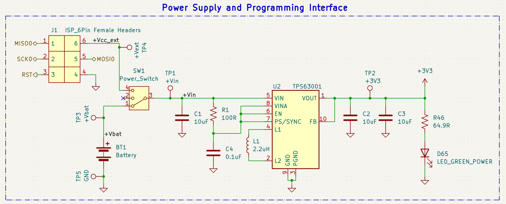
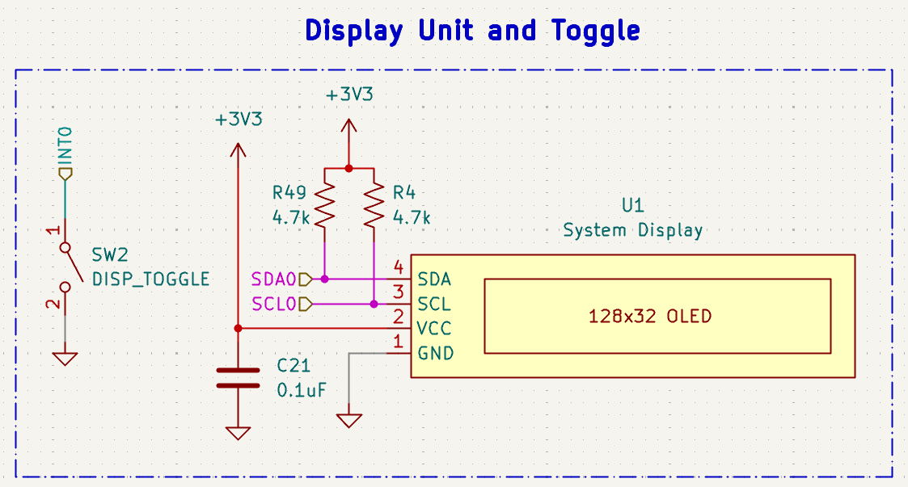
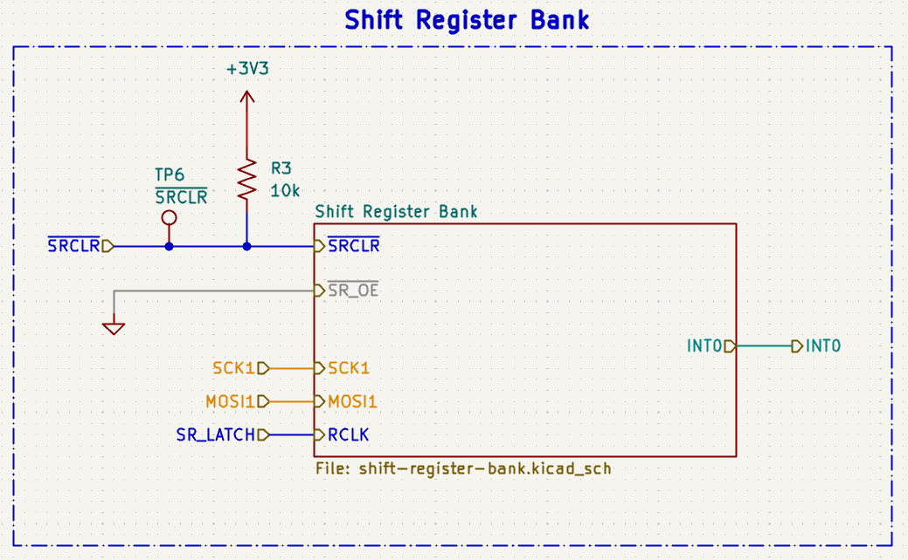
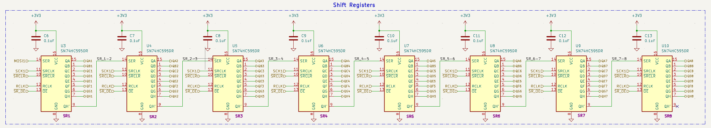
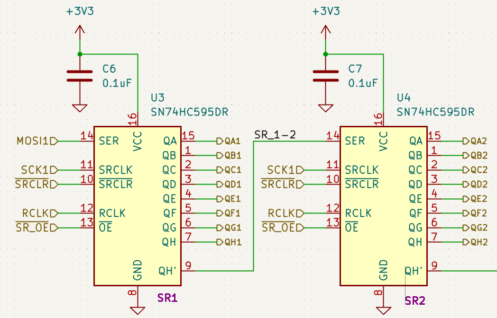
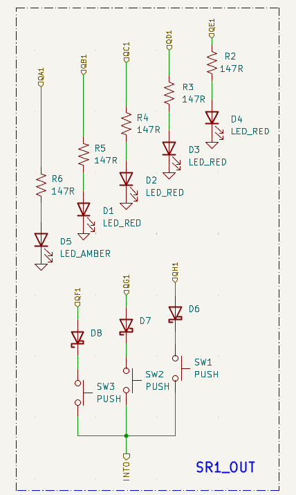
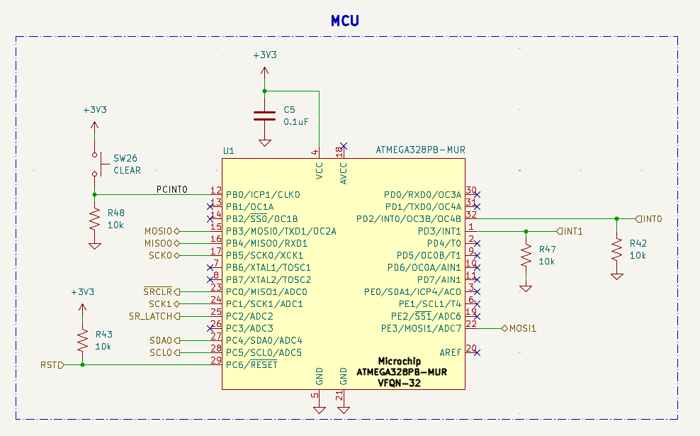

# Digicus (In-Progress)
A digital abacus trainer modeled after the Japanese Soroban.  The columns of beads are represented
by eight columns of five LEDs, with a toggleable OLED display showing in real time the numerical
number represented by the columns.  Beads can be "pushed up or down" by the use of pushbuttons
placed next to each column of LEDs, with a powered LED acting as a pushed-up bead for the four
lower "Earth Beads" of each column, representing 1s, and a pushed-down bead for the upper "Heaven Bead",
representing a 5.

The OLED display, alongside its toggle switch, allows the Digicus to be used as a trainer.  When
toggled on, the display allows for the user to continuously see the numerical representation of
the beads, enabling direct visual feedback of the current state of the abacus.  The display may
also be turned off, allowing the user to practice inputting a number or performing an arithmetic
operation on their own, and then turning the display back on to check their work.

********************************

## Project Progress

* Design Requirements \[**Completed**\]
* Design Specifications \[**Completed**\]
* Component Selection \[**Completed**\]
* Schematic Design \[**Completed**\]
* Functional Prototype \[**In-Progress**\]
* Firmware \[**In-Progress**\]
* Board Layout \[**To-Do**\]
* Board Manufacturing and Testing \[**To-Do**\]

********************************

## Sections

* [Design Requirements](#design-requirements)
* [Design Specifications](#design-specifications)
* [Component Selection](#component-selection)
* [Schematic Design](#schematic-design)
* [Functional Prototype](#functional-prototype)
* [Firmware](#firmware)

## Design Requirements

The following are my determined requirements for this design:

1. The Digicus must have enough columns of "beads" to perform useful calculations.
1. The Digicus must have an intuitive input method for interacting with the "beads".
1. The Digicus should be highly responsive to all inputs, reacting immediately.
1. The Digicus must be able to be operated portably, i.e. not have to be tethered to an
   outlet or cumbersome power supply for it to function.
1. The Digicus must be small enough to be portable, but large enough to be used
   comfortably.
1. The Digicus must feature a display that consumes relatively low power and is legible
   in well-lit environments.

## Design Specifications

The following are the design specifications along with the number of the design requirement, if any,
that they address in brackets:

* The Digicus will have 8 columns of 5 LEDs, for a total of 40 bead LEDs. \[1\]
    - The lower 4 LEDs will be red, with the upper LED being amber.  This adds an additional
        visual differentiatior between the heaven bead and the earth beads.
* The Digicus will use three pushbuttons per column of LEDs for interacting with the "beads",
  as well as a button for resetting the abacus to zero, for a total of 25 pushbuttons. \[2\]
    - Two of the pushbuttons for each column will be used for "pushing up" and "pushing down"
      earth beads with the third bead toggling the heaven bead.
* The Digicus will be powered by three NiMH AAA batteries in series or an external source, fed to a
  switching voltage regulator for a 3.3V supply voltage. \[4\], \[5\]
    - Using AAA batteries allows for an easily available, rechargeable, and relatively compact
      power source, close to the desired 3.3V supply voltage.
    - Employing a switching regulator instead of a linear regulator will allow for higher efficiency
      since the difference between the 3.6V provided by the series batteries and the 3.3V supply
      voltage output by a linear regulator will be lost as heat.  Any high frequency switching noise
      of the switching regulator will not be an issue since there are no high frequency data signals
      present in this design.
* The Digicus will use the Microchip ATmega328PB microcontroller to run the device. \[3\]
    - The ATmega328PB is cost-effective, easy to program, and can clock up to 10MHz at the
      desired 3.3V supply voltage, which is plenty fast enough for this application.
    - The ATmega328PB provides two independent I2C buses as well as two independent SPI buses,
      allowing for communication to the display, programming interface, and any other IC needed.
    - The ATmega328PB is available as a VQFN package, allowing for a small vertical footprint.
* The Digicus will employ the use of shift registers to expand the effective I/O of the MCU in order
  to interface with the large number of LEDs and pushbuttons.
* The Digicus will use a small OLED as its primary display. \[6\]
    - An OLED display will consume less power than a comparable LCD or seven segment display array, and
      provides a very high contrast ratio for easy viewing.

## Component Selection

The major components of the design will be specified in this section.  All passive components were selected with
proper derating, tolerances, and packaging in mind, but will not be specified here for brevity.

## Schematic Design

The Digicus schematic can be broken down into five major blocks:

* [Power Supply and Programming Interface](#power-supply-and-programming-interface)
* [Display](#display)
* [Shift Register Bank](#shift-register-bank)
* [Shift Register Outputs](#shift-register-outputs)
* [Microcontroller Connections](#microcontroller-connections)

Each will be described briefly in this section alongside an image of its section in the schematic.
The full schematic of the design can be viewed as a PDF in
[schematics/digicus-schematic.pdf](schematics/digicus-schematic.pdf).

### Power Supply and Programming Interface

The Digicus's 3.3V supply voltage is provided by the TI TPS63001 buck-boost converter, which is fed
either by a battery pack of three AAA NiMH batteries in series, or by an external DC source through
the Vcc_ext and GND connections of the 6-pin ISP interface.  External supply voltage must be within
1.8V - 5.5V to comply with the input range of the TPS63001.

The 6-pin ISP interface provides power, a connection to the MCU's reset pin, and connection to one of
the SPI buses of the MCU.  This allows for easy field programming of the MCU to flash firmware or power
the Digicus externally if desired.

The SP3T power switch allows the user to switch between the battery source, the external source, or
to turn the device off.

### Display

The display of the Digicus is a 128x32 OLED module built around the SSD1306 driver IC. The display
module already has integrated pull-up resistors in its front-end circuitry for the SDA and SCL
connections as well as a bypass capacitor across the power connections, which is why they are omitted
in my circuit.

The toggle switch shown adjacent to the display is connected to one of the hardware interrupt pins
of the MCU, and is set up such that the flipping of the switch triggers an interrupt that will read
the level of the same pin to determine the switch's orientation.  This allows for the up and down
position of the switch to always correspond to a single state of the OLED (on or off).

### Shift Register Bank

Above is a top level view of the shift register bank's inputs and output.  The operation of the shift register bank
requires only six external connections.  The MOSI and SCK pins of one of the SPI buses, two digital output
pins for latching the register's input state to its output and clearing the registers, a pull-down of the active-low
output enable pin since it does not need to be turned off in this design, and finally a connection to one of the external
interrupt pins of the MCU.

The LEDs making up the "beads" of the Digicus as well as the pushbuttons acting as an input interface
to interact with the LEDs are all controlled by the bank of eight TI SN74HC595 shift registers shown above.

Looking closer, each shift register has eight outputs, five allocated for a column of LED "beads" and three
for controlling the state of the pushbuttons. The MOSI connection from the MCU is connected to the first
register, with each following register being fed by the shifted out output of the previous one.  The four other
external connections are common to each register.

### Shift Register Outputs

### Microcontroller Connections

## Functional Prototype

## Firmware
